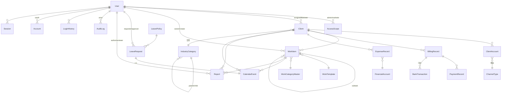

# VENOM ERP — DB 아키텍처 설계 (V2.1)

> 목적: 현재 스키마(Prisma + PostgreSQL/Neon)를 도메인 경계로 정리하고, **추후 다른 프로젝트(원고/이미지 스튜디오, 외부 회계·PG·은행 등)와 통합할 때 연계 가능한 구조**를 설계·반영한다.
> 이 문서는 “설계도”다. 실제 스키마 변경(마이그레이션)은 §7의 단계적 계획에 따라 **승인 후** 반영한다.

---

## 1. 설계 원칙

| 항목 | 결정 | 근거 |
| --- | --- | --- |
| ID | `cuid()` 문자열 PK 전면 사용 | 분산 생성 안전, 외부 노출 무해, 프로젝트 간 충돌 없음 |
| 금액 | `Decimal(12~14, 2)` + `currency`(기본 KRW) | 부동소수 오차 방지, 다통화 확장 여지 |
| 시간 | 전부 `DateTime`(UTC 저장) + 사용자 `timezone`(기본 Asia/Seoul) | 캘린더/마감 계산 일관성 |
| 반정형 데이터 | `Json`(`metadata`, `rawPayload`, `metrics`) | 외부 연동 원본·유연 필드 수용 |
| 삭제 | 물리삭제 지양 → `active`/`isActive`/`status` 소프트 상태 | 감사·정산 이력 보존 |
| 민감정보 | 계정 자격증명은 `AES-256-GCM`(`usernameEnc`/`passwordEnc`, `crypto.ts`) | 평문 저장 금지 |
| 변경 추적 | 모든 쓰기 액션 → `AuditLog`(before/after JSON) | 규제·책임 추적 |
| 마스터 데이터 | 업종/업무카테고리/채널을 별도 마스터 테이블 + 색상/정렬/잠금 | 코드 enum과 병행, 운영자 편집 가능 |

---

## 2. 도메인 경계 (Bounded Contexts)

ERP를 7개 컨텍스트 + 2개 횡단(cross-cutting)으로 나눈다. 통합 시 **이 경계가 그대로 연계 단위**가 된다.

| 컨텍스트 | 핵심 테이블 | 역할 |
| --- | --- | --- |
| **Identity & Access** | `User`, `AccessScope`, `Account`, `Session`, `VerificationToken` | 직원 인증·권한(스코프) |
| **CRM (거래처)** | `Client`, `ClientAccount`, `IndustryCategory`, `ChannelType` | 거래처·채널 계정·업종 |
| **Work (업무)** | `WorkItem`, `WorkTemplate`, `WorkCategoryMaster` | 업무/서브태스크/템플릿 |
| **Calendar** | `CalendarEvent` | 내부/구글/네이버 일정, 외부 동기화 |
| **Finance** | `BillingRecord`, `PaymentRecord`, `ExpenseRecord`, `FinancialAccount`, `BankTransaction` | 청구·수납·지출·계좌·입금대사 |
| **Leave (근태)** | `LeavePolicy`, `LeaveRequest` | 연차 정책·신청·승인 |
| **Reporting** | `Report` | 월간 보고서/성과 |
| **횡단: Audit/Tracking** | `AuditLog`, `LoginHistory` | 변경/접속 이력 |
| **횡단: Platform** | `CompanySetting`(+ 향후 `Organization`) | 회사 정책·테넌트 |

---

## 3. ERD (핵심 관계)



---

## 4. 모듈별 핵심 규칙(불변식)

- **Access**: 권한은 역할 enum이 아니라 `AccessScope`(admin↔marketer/client, `allMarketers`/`allClients` 와일드카드)로 표현. 서버 repository가 조회 시점에 스코프를 강제한다.
- **CRM**: `Client.code` **자동 발번(VC-0001)**, `unique`. 업종은 `IndustryCategory` 2단 트리(대분류→하위) + `industryCustom`(기타 수기). 채널 계정 자격증명은 암호화.
- **Work**: `WorkItem` 자기참조(`parentId`)로 서브태스크. `category`(enum)와 `workCategoryId`(마스터 FK) **병행 이관** 중.
- **Finance**: `BillingRecord`는 `@@unique([clientId, billingMonth])` (월 1청구). 수납은 `PaymentRecord`, 입금대사는 `BankTransaction.matchedBillingId`. PG/은행 연동 필드(`pgProvider`, `providerPaymentId`, `webhookStatus`, `externalTransactionId`) 내장.
- **Calendar**: `provider`(INTERNAL/GOOGLE/NAVER) + `external*Id`/`syncStatus`로 양방향 동기화 대비. `LeaveRequest`와 1:1.
- **Reporting**: `@@unique([clientId, reportingMonth])`, `metrics` Json.

---

## 5. 통합(연계) 설계 — 핵심

### 5.1 연계가 필요한 시나리오
1. **사내 다른 앱**: 원고 스튜디오 / 이미지 스튜디오(같은 Neon 사용 중) ↔ ERP의 거래처·업무.
2. **외부 SaaS**: 회계(더존/얼마 등), PG(토스/카카오/이니시스), 은행 입출금, 구글/네이버 캘린더.
3. **미래**: 다중 회사(멀티테넌트) 또는 파트너사에 ERP 데이터 일부 공개.

### 5.2 3계층 연계 전략

연계는 항상 **① 식별자·데이터 계약 → ② 통합 지점(어떻게 주고받나) → ③ 물리 배치(어디에 두나)** 세 층으로 설계한다.

#### ① 식별자 & 데이터 계약
- 내부 PK(`cuid`)는 **절대 외부 시스템에 의존시키지 않는다**. 대신 **연계 매핑 테이블**로 외부 ID를 이어붙인다.
- 이미 여러 모델에 흩어져 있는 외부 연동 필드(`CalendarEvent.externalEventId`, `ExpenseRecord.externalTransactionId`, `FinancialAccount.externalAccountId`, `PaymentRecord.providerPaymentId` …)를 **하나의 표준 패턴으로 수렴**한다 → `IntegrationLink`(§6).

#### ② 통합 지점
- **읽기 연계**: 안정적인 **DB View** 또는 **공개 REST/RPC**(cuid가 아닌 `code`/`slug` 노출)로만 제공. 타 프로젝트가 ERP 내부 테이블을 직접 join 하지 않게 한다.
- **쓰기/이벤트 연계**: **Transactional Outbox**(`EventOutbox`)에 도메인 이벤트를 본 트랜잭션과 함께 기록 → 별도 워커가 웹훅/큐로 발행. “업무 완료”, “청구 발행”, “거래처 생성” 등이 다른 앱을 깨운다.
- **인바운드**: 외부(PG/은행/스튜디오)가 ERP를 부를 땐 `WebhookEndpoint` + 서명 검증. 원본은 `rawPayload`/`metadata` Json에 보존.

#### ③ 물리 배치 (Neon/PostgreSQL)
- **1단계(현재~중기): 단일 Neon 프로젝트 + 스키마 분리.** ERP는 `public`(또는 `erp`) 스키마, 스튜디오 등은 각자 스키마. 공유가 필요한 **아이덴티티/조직**만 공통 `core` 스키마 + View로 노출.
- 환경 분리는 **Neon branch**(preview/prod)로. 마이그레이션은 branch에서 먼저 검증.
- **2단계(스케일/격리 필요 시): 프로젝트별 별도 DB** + 중앙 **Identity 서비스**(SSO). 이때 §6의 `Organization`/`IntegrationLink`가 그대로 연결 고리가 된다.

> 원칙: **처음부터 마이크로서비스로 쪼개지 않는다.** 단일 DB·스키마 분리로 시작하되, 경계(§2)와 매핑/이벤트 테이블(§6)을 미리 심어 두어 “쪼갤 수 있는 모놀리스”로 유지한다.

---

## 6. 연계-레디(Integration-ready) 스키마 반영안

> 모두 **추가(additive) 위주** — 기존 테이블/컬럼을 지우지 않으므로 무중단 반영 가능.

### 6.1 `Organization` (테넌트 경계)
```prisma
model Organization {
  id        String   @id @default(cuid())
  name      String
  slug      String   @unique         // 외부 노출용 안정 식별자
  createdAt DateTime @default(now())
  // 최상위 애그리거트에 orgId FK 추가: User, Client, WorkItem, BillingRecord, ExpenseRecord, Report ...
}
```
- 지금은 회사 1개 → **기본 org 1건 시드** 후 기존 로우 backfill. 코드/권한은 당장 안 바뀌지만, **멀티 회사·프로젝트 격리의 축**이 생긴다.

### 6.2 `IntegrationLink` (외부 식별자 표준 매핑)
```prisma
model IntegrationLink {
  id           String   @id @default(cuid())
  entityType   String   // "Client" | "WorkItem" | "BillingRecord" ...
  entityId     String   // 내부 cuid
  sourceSystem String   // "studio" | "toss" | "danawa-bank" | "google" ...
  externalId   String   // 외부 시스템의 ID
  externalUrl  String?
  payload      Json?
  syncedAt     DateTime @default(now())

  @@unique([sourceSystem, entityType, externalId])
  @@index([entityType, entityId])
}
```
- 모델마다 `external*Id`를 새로 붙이는 대신 **한 곳에서 N:M 외부연계**를 관리. 기존 흩어진 필드는 점진적으로 이 테이블로 흡수.

### 6.3 `EventOutbox` (신뢰성 있는 이벤트 발행)
```prisma
model EventOutbox {
  id            String    @id @default(cuid())
  aggregateType String    // "WorkItem" ...
  aggregateId   String
  eventType     String    // "work.completed" | "billing.issued" ...
  payload       Json
  occurredAt    DateTime  @default(now())
  publishedAt   DateTime?
  attempts      Int       @default(0)

  @@index([publishedAt, occurredAt])
}
```
- 도메인 쓰기 트랜잭션에서 함께 insert → 워커가 미발행분을 웹훅/큐로 전송. **at-least-once** 보장.

### 6.4 `WebhookEndpoint` / `ApiClient` (인바운드·아웃바운드 인증)
```prisma
model ApiClient {
  id         String   @id @default(cuid())
  name       String
  keyHash    String                    // 발급 키 해시
  scopes     String[]                  // ["clients:read","work:write"]
  orgId      String?
  isActive   Boolean  @default(true)
  createdAt  DateTime @default(now())
}
model WebhookEndpoint {
  id         String   @id @default(cuid())
  url        String
  secret     String
  eventTypes String[]                  // 구독 이벤트
  isActive   Boolean  @default(true)
}
```

### 6.5 공유 아이덴티티
- `User.email`을 프로젝트 공통 키로 삼되, 통합 시 **중앙 디렉터리 → 각 앱 매핑**은 `IntegrationLink(entityType="User", sourceSystem="sso")`로 처리. NextAuth `Account`(provider/providerAccountId)가 이미 외부 IdP 연결 지점을 제공.

---

## 7. 단계적 롤아웃 (expand → migrate → contract)

| Phase | 내용 | 위험 | 조건 |
| --- | --- | --- | --- |
| **P0 (지금)** | 본 설계 문서화 + 기존 `external*` 필드 인벤토리 정리 | 없음 | 완료 |
| **P1** | `Organization` 추가 + 기본 org 시드 + 주요 애그리거트 `orgId`(nullable→backfill→not null) | 낮음(additive) | 승인 시 |
| **P2** | `IntegrationLink`, `EventOutbox` 추가 + 쓰기 액션에서 outbox 기록 | 낮음 | 첫 외부 연계 착수 시 |
| **P3** | `ApiClient`/`WebhookEndpoint` + 공개 읽기 API(View 기반) | 중간 | 타 프로젝트 실연동 시 |

- 각 Phase는 **Neon preview branch**에서 `prisma migrate`로 먼저 검증 → prod 반영.
- Not-null 승격은 항상 **① 컬럼 추가(nullable) → ② backfill → ③ not-null 승격** 3스텝(expand/contract).

---

## 8. 미해결/후속 (설계와 함께 짚어둠)
- **업종 저장 버그**: `createClient`/`updateClient` 검증 스키마에 `industryCategoryId`/`industryCustom` 누락 → 폼 입력이 저장되지 않음. (P1 전에 별도 수정 권장)
- **로그인 방식**: 이메일 매직링크(현행) vs ID/PW 하이브리드 — 결정 대기. Credentials 도입 시 세션 전략 영향은 Identity 컨텍스트 내에서 격리.
- **category 이중화**: `WorkItem.category`(enum) ↔ `workCategoryId`(마스터) 이관 완료 후 enum 정리.
```
